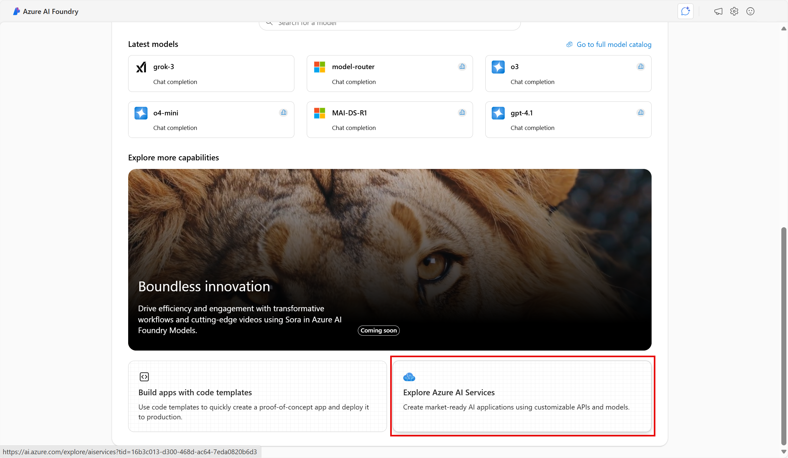

# 探索 Azure AI Foundry 中的内容安全

Azure AI 服务帮助用户借助开箱即用、预构建的可定制的 API 和模型创建 AI 应用程序。 在本练习中，你将了解其中一项服务（Azure AI 内容安全），以便审查文本和图像内容。 在 Azure AI Foundry 门户（Microsoft 创建智能应用程序的平台）中，你将使用 Azure AI 内容安全对文本进行分类，并为其分配严重性分数。 

> 注意：本练习的目标是大致了解 Azure AI 服务的预配和使用方式。 本练习出于示例目的使用内容安全，但你无需全面掌握内容安全！

## 在 Azure AI Foundry 门户中创建项目

1. 在浏览器选项卡中，导航到 [Azure Foundry 门户](https://ai.azure.com?azure-portal=true)。

2. 使用你的帐户登录。 

3. 在 Azure AI Foundry 门户主页上，选择“**创建项目**”。 在 Azure AI Foundry 中，项目是有助于组织工作的容器。  

    

4. 在“*创建项目*”窗格中，会看到生成的项目名称，可以按原样保留。 根据你过去是否创建了中心，你将看到要创建的*新* Azure 资源列表或现有中心的下拉列表。 如果看到现有中心的下拉列表，请选择“*新建中心*”，为中心创建唯一名称，然后选择“*下一步*”。  
 
    

> **重要说明**：需要在特定位置预配的 Azure AI 服务才能完成实验室的其余工作。

5. 在同一“*创建项目*”窗格中，选择“**自定义**”并选择以下“**位置**”之一：美国东部、法国中部、韩国中部、西欧或美国西部，以完成实验室的其余工作。 然后选择“**创建**”。 

1. 记下所创建的资源： 
- Azure AI 服务
- Azure AI 中心
- Azure AI 项目
- 存储帐户
- 密钥保管库
- 资源组  

6. 创建资源后，将转到项目的“*概述*”页。 

7. 要使用内容安全，需要对 *Azure AI 中心*资源进行权限更新。 为此，请打开 [Azure 门户](https://portal.azure.com?portal-azure=true)，并使用用于创建 AI Foundry 资源的同一订阅登录。  

8. 在 Azure 门户中，使用页面顶部的搜索栏查找并选择 **Azure AI Foundry**。 在“资源”页中，选择刚刚创建的*类型*为“**Azure AI 中心**”的资源。  

9. 在Azure 门户的左侧窗格中，选择“**访问控制 (IAM)**”。 然后在打开的窗格中，选择加号旁边的“添加”，然后选择“添加角色分配”********。 

10. 在角色列表中搜索“**Azure AI 安全计算器**”，然后选择它。 然后选择**下一步**。 

11. 使用以下设置将自己分配给该角色： 
    - 分配访问权限至****：选择“用户、组或服务主体”**
    - 成员****：单击“选择成员”**
        - 在打开的“选择成员”窗格中，找到你的姓名**。 单击你的姓名旁边的加号图标。 然后单击“选择”。
    - 说明****：留空**

12. 选择“查看并分配”，然后再次选择“查看并分配”以添加角色分配********。    

13. 在浏览器中，返回到 [Azure AI Foundry 门户](https://ai.azure.com?azure-portal=true)。 选择你的项目。 

14. 在屏幕上的左侧菜单中，选择“**AI 服务**”。
 
      

15. 在“*AI 服务*”页上，选择“*视觉 + 文档*”磁贴以试用 Azure AI 视觉和文档功能。
    
    

## 在 Azure AI Foundry 门户中试用内容安全的文本审查 

1. 在“*内容安全*”页面的“*筛选文本内容*”下，选择“**审查文本内容**”。

2. 在“*审查文本内容*”页的“*试用*”标题下，从下拉菜单中选择刚创建的 Azure AI 服务资源。   

3. 在“*运行简单测试*”下，选择“**安全内容**”磁贴。 请注意，文本将显示在下面的框中。 

4. 单击“运行测试”。 运行测试会调用内容安全服务的深度学习模型。 深度学习模型已经过训练，可识别不安全的内容。

5. 在“*结果*”面板中检查结果。 有四种严重级别，从“安全”到“高”，有四种类型的有害内容。 内容安全 AI 服务是否认为此示例是可接受的？ 需要注意的是，结果在置信区间内。 训练良好的模型（例如 Azure AI 的现成模型之一）所返回的结果大概率会与人类标记的结果相匹配。 每次运行测试时，都会再次调用模型。 

6. 现在尝试其他示例。 选择“暴力内容”下拼写错误的文本。 检查该内容是否显示在下面的框中。

7. 单击“**运行测试**”，然后再次检查“结果”面板中的结果。 

可以对提供的所有示例运行测试，然后检查结果。

## 清理

如果不打算做更多的练习，请删除任何不再需要的资源。 这可以避免产生任何不必要的成本。

1. 打开 [Azure 门户]( https://portal.azure.com)，然后选择包含你所创建的资源的资源组。
1. 选择该资源并选择“删除”，然后选择“是”以******** 进行确认。 这样便会删除该资源。

## 了解详细信息

本练习仅演示了“内容安全”服务的部分功能。 要详细了解此服务的更多用途，请参阅[内容安全页](https://learn.microsoft.com/azure/ai-services/content-safety/overview)。
