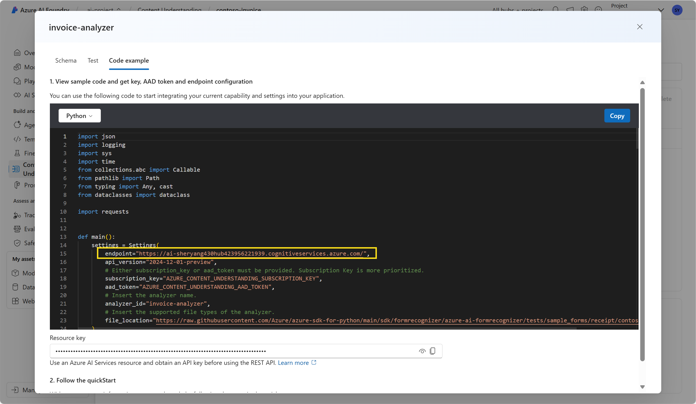

---
lab:
  title: 在 Azure AI Foundry 门户中使用内容理解提取数据
---

# 在 Azure AI Foundry 门户中使用内容理解提取数据

**Azure AI 内容理解（预览版）** 使用生成式 AI 将多种类型的内容（文档、图像、视频和音频）处理为用户定义的输出格式。

在本练习中，你将在 Azure AI Foundry 门户（Microsoft 创建智能应用程序的平台）中使用 Azure AI 内容理解来识别发票中的数据。 

此练习大约需要 **25** 分钟。

## 创建 Azure AI Foundry 项目

让我们首先创建 Azure AI Foundry 项目。

1. 在 Web 浏览器中打开 [Azure AI Foundry 门户](https://ai.azure.com)，网址为：`https://ai.azure.com`，然后使用 Azure 凭据登录。 关闭首次登录时打开的任何使用技巧或快速入门窗格，如有必要，使用左上角的 **Azure AI Foundry** 徽标导航到主页，类似下图所示（若已打开**帮助**面板，请关闭）：

    

1. 在主页中，选择“**+ 创建项目**”。

1. 在**创建项目**向导中，输入项目的有效名，如果出现建议使用现有中心的提示，请选择新建中心的选项。 然后查看将自动创建的 Azure 资源以支持中心和项目。

1. 选择“**自定义**”并为中心指定以下设置：
    - **中心名称**：*中心的有效名称*
    - **订阅**：Azure 订阅
    - **资源组**：*创建或选择资源组*
    - **位置**：美国西部 
    - **连接 Azure AI 服务或 Azure OpenAI**：*新建 AI 服务资源*
    - **连接 Azure AI 搜索**：跳过连接

1. 选择“**下一步**”查看配置。 然后，选择“**创建**”并等待该进程完成。

1. 创建项目后，关闭显示的所有使用技巧，并查看 Azure AI Foundry 门户中的项目页面，如下图所示：

    
 
1. 导航到屏幕左侧菜单。 然后选择“**AI 服务**”。

1. 在“*AI 服务*”页上，选择“*内容理解*”磁贴以试用 Azure AI 内容理解功能。

## 在 Azure AI Foundry 中使用 Azure AI 内容理解分析发票 

假设你想要从许多发票中提取数据，并将数据放入数据库中。 可以使用 Azure AI 内容理解分析一张发票并生成自己的分析器，以分析其他类似的发票。 首先创建内容理解任务。

1. 选择“**自定义分析器**”。 

1. 选择“**+ 创建**”并使用以下设置创建内容理解任务：
    - **任务名称**：contoso-invoice
    - **说明**：发票分析任务
    - **Azure AI 服务连接**：*使用默认值*
    - **Azure Blob 存储帐户**：*使用默认值*

1. 选择“**创建**”，然后等待任务创建完成。 
1. 选择 **contoso-invoice** 任务。 

#### 定义架构 

1. 在“*定义架构*”页上，可以添加测试文件。 从 `https://raw.githubusercontent.com/MicrosoftLearning/mslearn-ai-fundamentals/refs/heads/main/data/contoso-invoice-1.pdf` 中下载 [contoso-invoice-1.pdf](https://raw.githubusercontent.com/MicrosoftLearning/mslearn-ai-fundamentals/refs/heads/main/contoso-invoice-1.pdf)。 

1. 将文件上传到“*定义架构*”页。 选择*发票分析*模板。 发票模板具有分析器将尝试检测的预先选择的数据字段。 

    

1. 选择**创建**。 现在，你可以通过添加或删除字段来修改架构。 查看完字段后，选择“**保存**”。

    

1. 等待分析运行。 此过程可能需要花费片刻时间。

#### 测试分析器 

1. 分析完成后，你将能够在“*测试分析器*”页中查看分析器的运行情况。 查看“*字段*”选项卡。这些数据是否与发票上看到的内容一致？ 
    

1. 请注意每个字段旁边的*置信度分数*。 置信度分数表示模型对其结果准确性的信心程度。 置信度分数越接近 100% 的结果表示预测的置信度越高。
1. 查看“*结果*”选项卡。你在字段选项卡中看到的信息与在结果选项卡中以 JSON 格式显示的信息相同。 JSON 显示了信息发送到客户端应用程序和从客户端应用程序发送出去时的样子。 

    

1. 内容理解服务应正确标识与架构中的字段对应的文本。 如果尚未这样做，则可以使用“*标签数据*”页上传另一个示例表单，并显式标识每个字段的正确文本。 如果对分析器能够检测发票中数据的效果感到满意，请选择“**生成分析器**”选项卡。 

#### 生成分析器 

现在，你已训练了一个模型来提取示例发票中的字段，接下来可以生成一个分析器以用于类似的表单。 通过生成分析器，你可以部署模型并使用它来自动执行其他发票任务。

1. 在“*生成分析器*”选项卡中，选择“**+ 生成分析器**”。 输入以下内容： 
    - **名称**：invoice-analyzer
    - **说明**：发票分析器

    

1. 选择“**生成**”。 等待新分析器准备就绪（使用“刷新”按钮进行检查）。 分析器使用的预测模型基于你在前面步骤中定义的和测试的架构。 
1. 现在，让我们来尝试测试生成的分析器。 从 `https://raw.githubusercontent.com/MicrosoftLearning/mslearn-ai-fundamentals/refs/heads/main/data/contoso-invoice-2.pdf` 下载一张不同的 Contoso 发票 [contoso-invoice-2.pdf](https://raw.githubusercontent.com/MicrosoftLearning/mslearn-ai-fundamentals/refs/heads/main/data/contoso-invoice-2.pdf)。
1. 返回到“*生成分析器*”页，然后选择发票分析器链接。 将显示分析器架构中定义的字段。
1. 在发票分析器页中，选择“*测试*”。
1. 使用“**+ 上传测试文件**”按钮上传 *contoso-receipt-2.pdf*。 选择“**运行分析**”以从测试表单中提取字段数据。 查看测试的结果。

    

1. 选择“*代码示例*”选项卡。在代码中查找*终结点*。 在流程的*生成分析器*阶段，你已将内容理解模型部署到终结点。 终结点可用于类似于示例中所示的代码，以将模型合并到应用程序中的可重复流程。  

    

## 清理

如果已完成内容理解服务的使用，则应删除在本练习中创建的资源，以避免产生不必要的 Azure 成本。

- 在 Azure AI Foundry 门户中，导航到 contoso-receipt 项目并将其删除。
- 在 Azure 门户中，删除为这些练习创建的资源组。