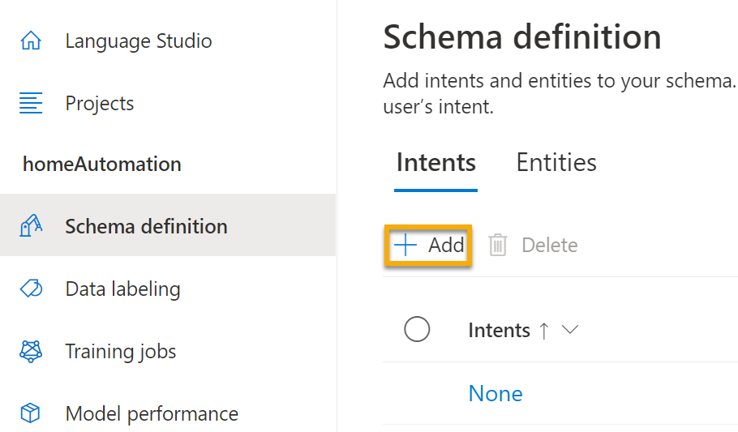
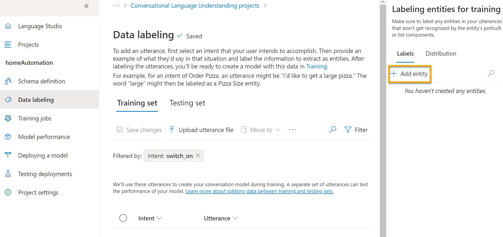

---
lab:
  title: 将对话语言理解服务与 Language Studio 配合使用
---

# 将对话语言理解服务与 Language Studio 配合使用

我们越来越希望计算机能够使用 AI 来理解口述或键入的自然语言命令。 例如，你可能希望家庭自动化系统使用语音命令（如“打开灯”或“将风扇打开”）来控制家庭中的设备。 AI 支持的设备可以理解这些命令并采取适当的行动。

在本练习中，你将使用 Language Studio 来创建和测试一个用于向灯或风扇等设备发送指令的项目。 你将使用对话语言理解服务的功能来配置项目。 

## 创建“语言”资源**

你可以将许多 Azure AI 语言功能与语言资源或 Azure AI 服务******** 资源配合使用。 在某些情况下，只能使用语言资源。 对于下面的练习，我们将使用语言**** 资源。 如果尚未这样做，可在 Azure 订阅中创建“语言”资源****。

1. 在另一个浏览器标签页中，打开 Azure 门户 ([https://portal.azure.com](https://portal.azure.com?azure-portal=true))，并使用与 Azure 订阅关联的 Microsoft 帐户登录。

1. 单击“&#65291; 创建资源”按钮，然后搜索“语言服务”******。 选择创建“语言服务”计划********。 你将转到相应页面以“选择其他功能”。 保留默认选择，然后单击“继续创建资源”****。 

1. 在“创建语言”**** 页面上，使用以下设置对其进行配置：
    - **订阅**：Azure 订阅。
    - **资源组**：选择或创建具有唯一名称的资源组。
    - 区域****：*选择离你最近的地理区域。如果在美国东部，请使用“美国东部 2”*。
    - **名称**：输入唯一名称。
    - **定价层**：“免费 F0”或“S”（如果“免费 F0”不可用）**
    - “选中此框即表示我确认我已阅读并理解以下所有条款”****：“已选择”**。

1. 依次选择“查看 + 创建”和“创建”，然后等待部署完成********。

### 创建对话语言理解应用程序

若要使用对话语言理解功能实现自然语言理解，请创建一个应用；然后添加实体、意图和言语来定义想要应用执行的命令。

1. 在新的浏览器标签页中，打开“Language Studio”门户 ([https://language.azure.com](https://language.azure.com?azure-portal=true))，然后使用与 Azure 订阅关联的 Microsoft 帐户登录。

1. 如果系统提示选择语言资源，请选择以下设置：
    - “Azure 目录”****：包含订阅的 Azure 目录。**
    - **Azure 订阅**：*你的 Azure 订阅*。
    - “语言资源”****：先前创建的语言资源**。

   如果系统未提示你选择语言资源，原因可能是订阅中有多个语言资源；在这种情况下，你应该：
    1. 在页面顶部的栏中，选择“设置(&#9881;)”****。
    2. 在“设置”页上，查看“资源”选项卡。
    3. 选择刚刚创建的语言资源，然后选择“切换资源”****。
    4. 在页面顶部，选择“Language Studio”**** 以返回到 Language Studio 主页。

1. 在门户顶部的“新建”菜单中，选择“对话语言理解”。

1. 在“创建项目”对话框的“输入基本信息”页面上，输入以下详细信息，然后选择“下一步”************：
    - **名称**：创建唯一名称
    - “语句主要语言”****：*英语*
    - **在项目中启用多种语言**： *不选择*
    - **说明**：`Simple home automation`

    > **提示**：记下项目名称，以便稍后使用**。

1. 在“查看并完成”页上，选择“创建标签” 。

### 创建意图、言语和实体

意向是你想要执行的操作；例如，你可能需要开灯或关闭风扇。 在这种情况下，将定义两个意向：一个打开设备，另一个关闭设备。 对于每个意向，都要指定示例言语来表明用于指示意向的语言类型。

1. 在“架构定义”窗格中，确保选中“意图”。然后选择“添加”，并添加名为“`switch_on`”（小写）的意图，最后选择“添加意图”****************。

    

    

1. 选择“switch_on”意图。 你将转到“数据标签”页。 在“意向”下拉列表中，选择“switch_on” 。 在“switch_on”意图旁边，键入语句“`turn the light on`”，然后按 Enter，将此语句提交到列表中********。

    

1. 语言服务需要为每个意向提供至少五个不同的语句示例，以便充分训练语言模型。 将其他五个言语示例添加到“switch_on”意图：  
    - `switch on the fan`
    - `put the fan on`
    - `put the light on`
    - `switch on the light`
    - `turn the fan on`

1. 在屏幕右侧的“标记用于训练的实体”窗格上选择“标签”，然后选择“添加实体”。 键入“`device`”（小写），选择“列表”，然后选择“添加实体”********。

    

    

1. 在“turn the fan on”语句中，突出显示“fan”一词。 然后在出现的列表中，在“搜索实体”框中选择“device”。

    

1. 对所有言语执行相同的操作。 使用设备实体标记其余“fan”（风扇）或“light”（灯）言语。 完成后，请验证是否具有以下言语，并且请务必选择“保存更改”：

    | 意向 | 语句 | 实体 |
    | --------------- | ------------------ | ------------------ |
    | switch_on   | Put on the fan      | 设备 - 选择风扇 |
    | switch_on   | Put on the light    | 设备 - 选择灯 |
    | switch_on   | Switch on the light | 设备 - 选择灯 |
    | switch_on   | Turn the fan on     | 设备 - 选择风扇 |
    | switch_on   | Switch on the fan   | 设备 - 选择风扇 |
    | switch_on   | Turn the light on   | 设备 - 选择灯 |

     

1. 在左侧窗格中，选择“架构定义”并验证是否列出了“switch_on”意图********。 然后选择“添加”并添加一个名为“`switch_off`”（小写）的新意图。****

     

1. 选择“switch_off”意图。**** 你将转到“数据标签”页。 在“意向”下拉列表中，选择“switch_off” 。 在“switch_off”意图旁边，添加语句“`turn the light off`”****。

1. 将其他五个语句示例添加到“switch_off”意图。
    - `switch off the fan`
    - `put the fan off`
    - `put the light off`
    - `turn off the light`
    - `switch the fan off`

1. 使用设备实体标记字词“light”（灯）或“fan”（风扇）。 完成后，请验证是否具有以下言语，并且请务必选择“保存更改”：  

    | 意向 | 语句 | 实体 | 
    | --------------- | ------------------ | ------------------ |
    | switch_off   | Put the fan off    | 设备 - 选择风扇 | 
    | switch_off   | Put the light off  | 设备 - 选择灯 |
    | switch_off   | Turn off the light | 设备 - 选择灯 |
    | switch_off   | Switch the fan off | 设备 - 选择风扇 |
    | switch_off   | Switch off the fan | 设备 - 选择风扇 |
    | switch_off   | Turn the light off | 设备 - 选择灯 |

### 定型模型

现在，可以使用定义的意图和实体来为应用程序训练对话语言模型。

1. 在 Language Studio 的左侧，选择“训练作业”，然后选择“开始训练作业”。 使用以下设置：
    - **训练新模型**： 已选择并选择模型名称
    - **训练模式**：标准训练（免费）
    - **数据拆分**：选择“从训练数据中自动拆分测试集”，保留默认百分比
    - 选择页面底部的“训练”****。

1. 等待训练完成。

### 部署并测试模型

若要在客户端应用程序中使用训练的模型，必须将其部署为终结点，客户端应用程序将能够向其发送新言语，并且可通过该终结点预测意向和实体。

1. 在 Language Studio 的左侧，选择“部署模型”****。

1. 选择模型名称，然后选择“添加部署”****。 使用以下设置：
    - **创建或选择现有部署名称**：选择“创建新的部署名称”。添加唯一名称。
    - **将经过训练的模型分配到部署名称**：选择经过训练的模型名称。
    - 选择“部署”****

    > **提示**：记下部署名称，以便稍后使用**。 

1. 部署模型后，选择页面左侧的“测试部署”，然后在“部署名称”下选择自己的已部署模型********。

1. 输入以下文本，然后选择“运行测试”：

    `switch the light on`

     

    查看返回的结果，注意它包含预测意向（哪些应该是 switch_on）和预测实体（设备），其置信度分数表示该模型所计算的预测意向和实体计算的概率。 “JSON”选项卡显示每个潜在意向的对比置信度（置信度分数最高的潜在意向就是预测意向）

1. 清除文本框，并在“输入自己的文本或上传文本文档”下使用以下语句测试模型：
    - `turn off the fan`
    - `put the light on`
    - `put the fan off`

现已成功配置对话语言项目，并定义了实体、意图和语句。 你已了解如何在 Language Studio 中训练和部署模型。 你已使用自己定义的两个语句进行尝试，还使用了一些你未明确定义但模型能够确定的语句。

> 注意****：对话语言理解提供了解读输入意图的智能；它不执行任何操作，如打开灯或风扇。 开发人员需要生成一个应用程序，由该应用程序使用对话语言理解模型来确定用户的意图，然后自动执行相应的操作。

## 清理

如果不打算做更多的练习，请删除任何不再需要的资源。 这可以避免产生任何不必要的成本。

1. 打开 [Azure 门户]( https://portal.azure.com)，然后选择包含你所创建的资源的资源组。 1. 选择该资源并选择“删除”，然后选择“是”以******** 进行确认。 这样便会删除该资源。

## 了解详细信息

该应用只显示了语言服务的对话语言理解的部分功能。 要详细了解此服务的用途，请参阅[“对话语言理解”页](https://docs.microsoft.com/azure/cognitive-services/language-service/conversational-language-understanding/overview)。
