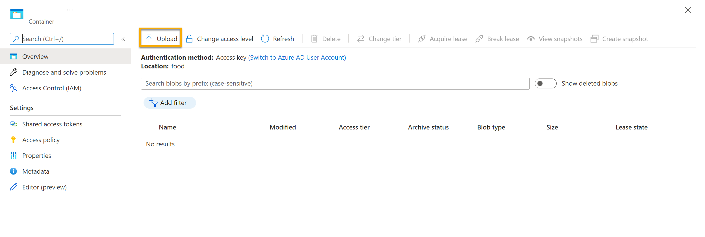
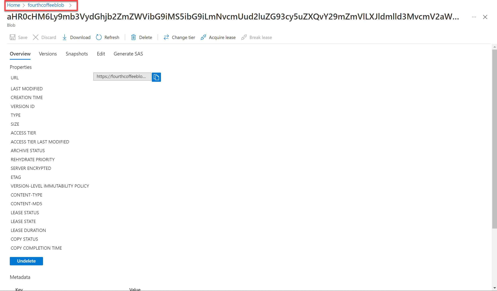

---
lab:
  title: 探索 Azure AI 搜索索引 (UI)
---

# 探索 Azure AI 搜索索引 (UI)

假设你就职于一家全国咖啡连锁店 Fourth Coffee。 你需要帮助构建一个知识挖掘解决方案，以便轻松搜索有关客户体验的见解。 你决定使用从客户评价中提取的数据生成 Azure AI 搜索索引。  

在此实验室中，你将：

- 创建 Azure 资源
- 从数据源提取数据
- 利用 AI 技能扩充数据
- 在 Azure 门户中使用 Azure 的索引器
- 查询搜索索引
- 查看保存到知识存储的结果

## 需要的 Azure 资源

你要为 Fourth Coffee 创建的解决方案需要使用 Azure 订阅中的以下资源：

- Azure AI 搜索**** 资源，用于管理索引和查询。
- Azure AI 服务**** 资源为搜索解决方案所需技能提供 AI 服务，以便使用 AI 生成的见解来丰富数据源中的数据。

    > 注意：你的 Azure AI 搜索和 Azure AI 服务资源必须位于同一位置****！

- 一个包含 Blob 容器的存储帐户，它将存储原始文档以及表、对象或文件的其他集合。

### 创建 Azure AI 搜索资源**

1. 登录到 [Azure 门户](https://portal.azure.com/learn.docs.microsoft.com?azure-portal=true)。

1. 单击“+ 创建资源”按钮，搜索“Azure AI 搜索”，然后使用以下设置创建“Azure AI 搜索”资源**********：

    - **订阅**：Azure 订阅。
    - **资源组**：选择或创建具有唯一名称的资源组。
    - **服务名称**：唯一名称。
    - 位置****：*选择任何可用区域。如果在美国东部，请使用“美国东部 2”*。
    - 定价层：基本

1. 选择“查看 + 创建”，并在看到“验证成功”响应后，选择“创建”。

1. 部署完成后，选择“转到资源”。 在 Azure AI 搜索概述页面上，你可以添加索引、导入数据和搜索创建的索引。

### 创建 Azure AI 服务资源

你需要预配一个与 Azure AI 搜索资源位于同一位置的 Azure AI 服务资源。**** 搜索解决方案将使用该资源通过 AI 生成的见解来丰富数据存储中的数据。

1. 返回到 Azure 门户的主页。 单击“&#65291;创建资源”按钮，然后搜索“Azure AI 服务”。 选择创建 Azure AI 服务计划。 随后你会转到一个页面，可在其中创建 Azure AI 服务资源。 使用以下设置对其进行配置：
    - **订阅**：Azure 订阅。
    - 资源组****：你的 Azure AI 搜索资源所在的同一资源组**。
    - 区域****：你的 Azure AI 搜索资源所在的同一位置**。
    - **名称**：唯一名称。
    - 定价层：标准版 S0
    - **选中此框即表示我确认我已阅读并理解以下所有条款**：已选中

1. 选择“查看 + 创建”。 看到“验证通过”的回应后，选择“创建”。

1. 等待部署完成，然后查看部署详细信息。

### 创建存储帐户

1. 返回 Azure 门户的主页，然后选择“+ 创建资源”按钮。

1. 搜索“存储帐户”，并使用以下设置创建“存储帐户”资源：
    - **订阅**：Azure 订阅。
    - 资源组****：你的 Azure AI 搜索资源和 Azure AI 服务资源所在的同一资源组**。
    - **存储帐户名称**：唯一名称。
    - **位置**：选择任何可用位置。
    - **性能**：标准
    - 冗余：本地冗余存储 (LRS)

1. 单击“查看”，然后单击“创建” 。 等待部署完成，然后转到已部署的资源。

1. 在创建的 Azure 存储帐户的左侧菜单窗格中，选择“配置”（位于“设置”下）。
1. 将“*允许 Blob 匿名访问*”的设置更改为 “**已启用**”，然后选择“**保存**”。

## 将文档上传到 Azure 存储

1. 在左侧菜单窗格中，选择“容器”。

    

1. 选择“+ 容器”。 右侧窗格将打开。

1. 输入以下设置，然后单击“创建”：
    - 名称：coffee-reviews  
    - 公共访问级别：容器（对容器和 Blob 进行匿名读取访问）
    - 高级：无更改。

1. 在新的浏览器标签页中，从 `https://aka.ms/mslearn-coffee-reviews` 下载[压缩的咖啡评价文件](https://aka.ms/mslearn-coffee-reviews)，然后将这些文件提取到 reviews 文件夹**。

1. 在 Azure 门户中选择 coffee-reviews 容器。 在容器中选择“上传”。

    

1. 在“上传 Blob”窗格中，选择“选择文件” 。

1. 在资源管理器窗口中，选择“评价”文件夹中的“全部”文件，选择“打开”，然后选择“上传”。

    

1. 上传完成后，可以关闭“上传 Blob”窗格。 现在，文档位于 coffee-reviews 存储容器中。

## 为文档编制索引

将这些文档放置在存储空间中后，可以使用 Azure AI 搜索来从文档中提取见解。 Azure 门户提供了导入数据向导。 使用此向导，可以为支持的数据源自动创建索引和索引器。 你将使用该向导创建索引，以及将搜索文档从存储空间导入到 Azure AI 搜索索引中。

1. 在 Azure 门户中，浏览到 Azure AI 搜索资源。 在“概述”页上，选择“导入数据”。

    

1. 在“连接到数据”页面上的“数据源”列表中，选择“Azure Blob 存储”。 使用下列值完成数据存储详细信息：
    - **数据源**：Azure Blob 存储
    - 数据源名称：coffee-customer-data
    - 要提取的数据：内容和元数据
    - 分析模式：默认值
    - 连接字符串：*选择“选择现有连接”。 选择存储帐户，选择“coffee-reviews”容器，然后单击“选择”。
    - 托管标识身份验证：无
    - 容器名称：在选择现有连接后自动填充此设置。
    - Blob 文件夹：将此选项留空。
    - 说明：对 Fourth Coffee 店铺的评价。

1. 选择“下一步: 添加认知技能(可选)”。

1. 在“附加 AI 服务”部分，选择 Azure AI 服务资源****。  

1. 在“添加扩充”部分中：
    - 将技能集名称更改为 coffee-skillset。
    - 选中“启用 OCR”选项，将所有文本合并到 merged_content 字段中”复选框。
        > 注意：必须选择“启用 OCR”才能查看所有扩充字段选项 。
    - 确保“源数据”字段设置为“merged_content”。
    - 将“扩充粒度级别”更改为“页(5000 个字符区块)”。
    - 不要选择“启用增量扩充”
    - 选择以下扩充字段：

        | 认知技能 | 参数 | 字段名称 |
        | --------------- | ---------- | ---------- |
        | 提取位置名称 | | locations |
        | 提取关键短语 | | keyphrases |
        | 检测情绪 | | 情绪 |
        | 从映像中生成标记 | | imageTags |
        | 从映像中生成描述文字 | | imageCaption |

1. 在“将扩充保存到知识存储”下，选择：
    - 图像投影
    - 文档
    - 页数
    - 关键短语
    - 实体
    - 图像详细信息
    - 图像引用

    > 注意**** 出现要求“存储帐户连接字符串”**** 的警告。
    >
    > 
    >

1. 选择“现有连接”。 选择前面创建的存储帐户。
    > 1. 单击“**+ 容器**”以新建名为 **knowledge-store** 的容器，其隐私级别设置为“**专用**”，然后选择“**创建**”。
    > 1. 选择 knowledge-store 容器，然后单击屏幕底部的“选择”。

1. 选择“**Azure Blob 投影: 文档**”。 这将显示已自动填充 knowledge-store 容器的“容器名称”设置。 不要更改容器名称。

1. 单击“下一步：自定义目标索引”。 将索引名称更改为 coffee-index。

1. 确保“密钥”设置为 metadata_storage_path。 将“建议器名称”留空，并自动填充“搜索模式”。

1. 查看索引字段的默认设置。 对于默认选中的所有字段，请选择“可筛选”。 需要标记为“可筛选”** 的字段名称包括：内容、位置、键短语、情绪、merged_content、文本、layoutText、imageTags、imageCaption。

    

1. 选择“下一步:创建索引器”。

1. 将索引器名称 更改为 coffee-indexer。

1. 将“计划”设置为“一次”。

1. 选择“提交”以创建数据源、技能组、索引和索引器。 索引器将自动运行并运行索引管道，该索引管道可以：
    - 从数据源中提取文档元数据字段和内容。
    - 运行认知技能的技能组，以生成更多的扩充字段。
    - 将提取的字段映射到索引。

1. 返回到 Azure AI 搜索资源页。 在左窗格中的“搜索管理”下，选择“索引器”。******** 选择新创建的“coffee-indexer”。**** 稍等片刻，然后选择“&orarr; 刷新”，直到“状态”显示“成功” 。

1. 选择索引器名称以查看更多详细信息。

    

## 查询索引

使用搜索资源管理器编写和测试查询。 搜索资源管理器是 Azure 门户中的内置工具，提供一种用于验证搜索索引质量的简便方法。 可以使用搜索资源管理器来编写查询并查看 JSON 中的结果。

1. 在搜索服务的“概述”页中，选择屏幕顶部的“搜索资源管理器”。

   

2. 请注意，所选索引为创建的 coffee-index。 在所选索引下方，将“视图”更改为“JSON 视图”。****** 

    

在“JSON 查询编辑器”字段中，复制粘贴：**** 
```json
{
    "search": "*",
    "count": true
}
```
3. 选择**搜索**。 搜索查询会返回搜索索引中的所有文档，在 @odata.count 字段中包含所有文档的计数。 搜索索引应返回包含搜索结果的 JSON 文档。

4. 现在，让我们按位置进行筛选。 在“JSON 查询编辑器”字段中，复制粘贴：**** 
```json
{
    "search": "locations:'Chicago'",
    "count": true
}
```
5. 选择**搜索**。 查询将搜索索引中的所有文档，并筛选出芝加哥位置的评论。 应在 `@odata.count` 字段中看到 `3`。

6. 现在，让我们按情绪进行筛选。 在“JSON 查询编辑器”字段中，复制粘贴：**** 
```json
{
    "search": "sentiment:'negative'",
    "count": true
}
```
7. 选择**搜索**。 查询将搜索索引中的所有文档，并筛选出具有负面情绪的评论。 应在 `@odata.count` 字段中看到 `1`。

   > 注意：查看结果如何按 `@search.score` 排序。 这是搜索引擎给出的评分，指示结果与给定查询的匹配程度。

8. 我们可能想要解决的问题之一就是某些评价存在的原因。 让我们看看与负面评价相关的关键短语。 你认为哪些原因可能会导致这种评价？

## 查看知识存储

让我们看看运行中的知识存储的强大功能。 运行导入数据向导时，还创建了一个知识存储。 在知识存储中，你将发现由 AI 技能提取的扩充数据以投影和表的形式保存。

1. 在 Azure 门户中，导航回你的 Azure 存储帐户。

2. 在左侧菜单窗格中，选择“容器”。 选择“knowledge-store”容器。 

    

3. 你将看到一个文件夹列表。 每个审阅文档的所有元数据都有一个文件夹。 **** 选择任意文件夹。 在文件夹中，单击 objectprojection.json**** 文件。

    

4. 选择“编辑”以查看为 Azure 数据存储中的一个文档生成的 JSON。

    

5. 选择屏幕左上角的存储 Blob 痕迹导航，返回到存储帐户容器。

    

6. 在“容器”中选择 coffee-skillset-image-projection 容器。 选择任意项目。

    

7. 选择任意 .jpg 文件。 选择“编辑”以查看存储在文档中的图像。 请注意如何以这种方式存储文档中的所有图像。

    

8. 选择屏幕左上角的存储 Blob 痕迹导航，返回到存储帐户容器。

9. 在左侧面板中选择“存储浏览器”，然后选择“表” 。 索引中的每个实体都有一个表。 选择 coffeeSkillsetKeyPhrases 表。

    查看知识存储能够从评价内容中捕获的关键短语。 许多字段都是键，因此你可关联表，例如关系数据库。 最后一个字段显示技能组提取的关键短语。

## 了解详细信息

此简单搜索仅为 Azure AI 搜索服务的某些功能建立索引。 若要详细了解此服务的用途，请参阅 [Azure AI 搜索服务页面](https://learn.microsoft.com/azure/search)。
