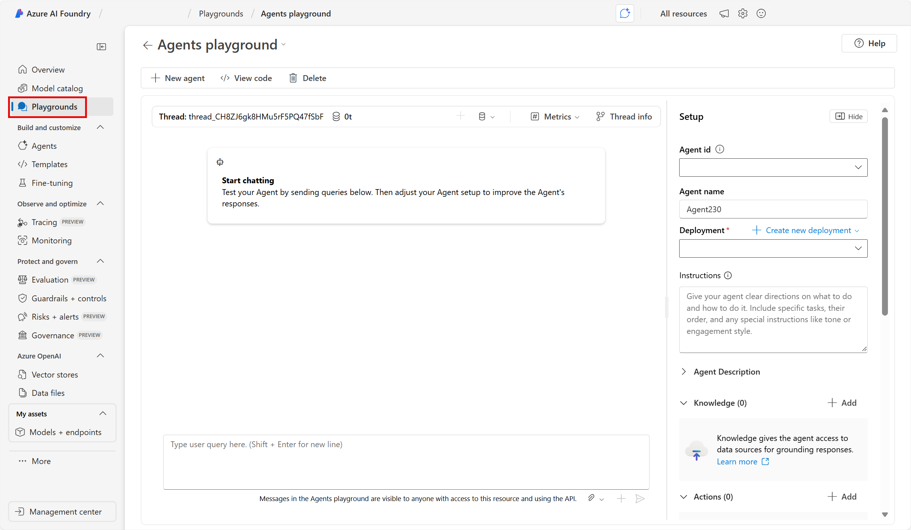

---
lab:
  title: 探索 Azure AI Foundry 门户中的生成式 AI
---

# 在 Azure AI Foundry 门户中探索生成式 AI

生成式 AI 描述 AI 中用于创建内容的一类功能。 人员通常与聊天应用程序中内置的生成式 AI 交互。 在本练习中，你将试用 Azure AI Foundry 门户（Microsoft 创建智能应用程序的平台）中的生成式 AI。 

## 在 Azure AI Foundry 门户中创建项目

让我们首先创建 Azure AI Foundry 项目。

1. 在 Web 浏览器中打开 [Azure AI Foundry 门户](https://ai.azure.com)，网址为：`https://ai.azure.com`，然后使用 Azure 凭据登录。 关闭首次登录时打开的任何使用技巧或快速入门窗格，如有必要，使用左上角的 **Azure AI Foundry** 徽标导航到主页，类似下图所示（若已打开**帮助**面板，请关闭）：

    

1. 在主页中，选择“**+ 创建代理**”。

1. 在**创建代理**向导中，输入项目有效名称。 

1. 选择“**高级选项**”，并配置以下设置：
    - **Azure AI Foundry 资源**：*保留默认名称*
    - **订阅**：Azure 订阅
    - **资源组**：*创建或选择资源组*
    - **区域**：请选择以下位置之一：
        * 美国东部
        * 法国中部
        * 韩国中部
        * 西欧
        * 美国西部

1. 选择“**创建**”，并查看你的配置。 等待设置过程完成。

    >**备注**：如果遇到权限错误，请选择“**修复**”按钮，添加相应的权限以继续。

1. 创建项目后，默认情况下会转到 Azure AI Foundry 门户中的 Agents playfround，如下图所示：

    

1. 在屏幕左侧菜单中，选择“**操场**”。

## 在 Azure AI Foundry 的聊天操场中探索生成式 AI

1. 在 Azure AI Foundry 的“操场”页中，选择“**试用聊天操场**”。 聊天操场是一个用户界面，可用于尝试使用不同的生成式 AI 模型构建聊天应用程序。  

1. 若要使用聊天操场，需要将其与已部署的模型相关联。 在“聊天操场”中，选择“**创建部署**”。 搜索并选择 **gpt-4**。 

1. 在“*部署模型*”窗口中，保留默认命名和选择，然后选择“**部署**”。 模型可能需要一些时间才能部署。 可以通过在“*我的资产*”下的左侧菜单中选择 *“模型”和“终结点”*，来检查部署的状态。
1. 在聊天操场中，可以在“*部署*”选择菜单中显示已部署的模型时使用该模型。 确保选择已部署的模型。 重要的是，在对“*设置*”进行任何更改后，需要选择“**应用更改**”。 

1. 请考虑通过以下方法改进来自生成式 AI 助手的响应：
    - 从希望助手执行的具体目标开始
    - 根据先前的提示和响应进行迭代以完善结果
    - 提供一个来源，用于在特定信息范围内为响应打好基础
    - 添加上下文以最大限度地提高响应的适当性和相关性
    - 为响应设定明确的期望

1. 让我们尝试使用具有特定目标的提示生成响应。 在“聊天”框中，输入以下提示：

    ```prompt
    I'm planning a trip to Paris in September. Can you help me?
    ```

1. 查看回应。 **备注**：请记住，收到的特定响应可能因生成式 AI 的性质而异。
 
1. 让我们尝试另一个提示： 输入以下内容：

    ```prompt
    Where's a good location in Paris to stay? 
    ```

1. 查看响应，其中应提供巴黎的一些住宿地点。

1. 根据先前的提示和响应进行迭代，以优化结果。 输入以下提示：
    
    ```prompt
    Can you give me more information about dining options near the first location?
    ``` 

1. 查看响应，该响应应提供上一响应中某个位置附近的餐饮选项。 

1. 现在，让我们提供一个来源，用于在特定信息范围内为响应打好基础。 输入以下内容： 
    
    ```prompt
    Based on the information at https://en.wikipedia.org/wiki/History_of_Paris, what were the key events in the city's history?
    ```

1. 查看响应，该响应应基于提供的网站提供信息。 

1. 让我们尝试添加上下文，以最大化响应的相关性。 输入以下提示： 

    ```prompt
    What three places do you recommend I stay in Paris to be within walking distance to historical attractions? Explain your reasoning.
    ```

1. 查看响应及其推理。  

1. 现在为响应设定明确的期望。 输入以下提示：
    
    ```prompt
    What are the top 10 sights to see in Paris? Answer with a numbered list in order of popularity.
    ```

1. 查看响应，该响应应提供一个在巴黎看到的景点编号列表。

1. 完成后，可以关闭浏览器窗口。
