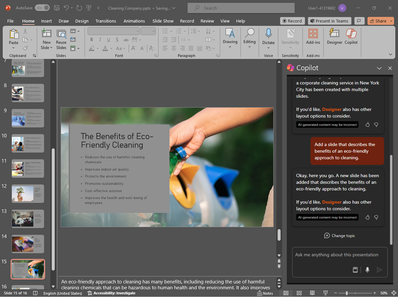

---
lab:
  title: 探索适用于 Microsoft 365 的 Copilot
---
# 探索适用于 Microsoft 365 的 Copilot

在本练习中，你将探索 Microsoft Copilot 可以使用生成式 AI 的一些方法，以帮助你在创建新内容时提高生产力。 在本练习的方案中，你将从业务理念的一些高级说明入手，并在多个应用（如 Word、PowerPoint 和 Excel）中使用适用于 Microsoft 365 的 Copilot 帮助你制定商业计划和制作面向潜在投资者的演示文稿。

完成此练习大约需要 40 分钟。

> **注意**：本练习需要使用组织提供的 **适用于 Microsoft 365 的 Copilot** 许可证。

## 使用 Copilot 来探索文档并研究想法

为了开始探索生成式 AI，我们将使用适用于 Word 的 Copilot 检查现有文档并从中提取一些见解。

1. 在 Web 浏览器中，打开位于 `https://github.com/MicrosoftLearning/mslearn-ai-fundamentals/raw/main/data/generative-ai/Business%20Idea.docx` 的文档 [Business Idea.docx](https://github.com/MicrosoftLearning/mslearn-ai-fundamentals/raw/main/data/generative-ai/Business%20Idea.docx)。 
1. 选择“下载”，以将文件保存到电脑的“下载”文件夹中********。
1. 将刚下载的文档“移动”或“复制并粘贴”到“OneDrive”文件夹************。
1. 在“OneDrive”文件夹中****，在 Microsoft Word 中打开 **Business Idea.docx**（关闭任何欢迎消息或新功能通知），并查看文档，其中描述了有关纽约市一家清洁公司的一些高级想法。 如果出现提示，请选择顶部的“启用编辑”****。
1. 在 Word 工具栏上查找并选择“Copilot”图标以打开 Copilot 窗格，如下所示（视觉主题可能会有所不同）****：

    

1. 在 Copilot 窗格中，在底部的文本区域中输入以下提示：

    ```
    What is this document about?
    ```

1. 查看 Copilot 的回复，该回复应当汇总文档中的要点，如下所示：

    

    > 收到的特定响应可能因生成式 AI 的性质而异。

1. 返回到 Copilot 窗格，以向 Copilot 提出以下问题：

    ```
    How do I setup a new business in New York?
    ```

1. 查看响应并根据需要跟进其他问题。 如果对响应感到满意，请使用响应下的“复制”(&#128461;) 图标将其复制到剪贴板****。 将其粘贴到 Word 文档中，选择所有文本，然后选择 Copilot 图标（在所选文本的底部）将文本可视化为表格。

    

1. 查看表格并要求 Copilot 添加更多信息，例如有关更多详细信息的引用。  响应外观应如下所示（可能需要使用“重新生成”按钮）****：

    

    > **重要说明**：AI 生成的回复基于网上公开的信息。 虽然它可能有助于你了解创业所需的步骤，但它能不保证 100% 准确，也不能取代对专业建议的需求！

1. 如果对 Copilot 生成的表格感到满意，请选择“保留”选项。****

## 使用 Copilot 创建商业计划的内容

现在你已经做了一些初步调查，接下来让 Copilot 帮助你为你的清洁公司制定商业计划。

1. 在 **Business Idea.docx** 文档仍处于打开状态下，在 Copilot 窗格中，输入以下提示：

    ```
    Can you suggest a name for my cleaning business?
    ```

1. 查看建议并为你的清洁公司选择一个名称（或继续进行提示以找寻一个你喜欢的名称）。
1. 在 Word 文档中，选择边距中的 Copilot 图标以起草新内容。 输入以下提示，并将 **Contoso Cleaning** 替换为你选择的公司名称：

    ```
    Write a business plan for "Contoso Cleaning" based on the information in this document. Include an executive summary, market overview, and financial projections.
    ```

    

1. 查看 Copilot 起草的回复，并保留它，调整语气、长度，或要求 Copilot 根据新的提示进行改写。 向文档应用适当的标题和样式，以增强其专业性。 响应应如下所示：

    

1. 如果商业计划中财务预测未采用表格格式，请选择它们并使用 Copilot 将预测可视化为表格。
1. 选择财务预测表并将其复制到剪贴板。
1. 保存 Word 文档，然后将其关闭。

## 在适用于 Excel 的 Copilot 中可视化财务预测

借助商业计划，我们可获取一些有关财务预测的数据，并要求 Excel 中的 Copilot 可视化这些数据，以便我们可以将其包含在电子邮件或向投资者的演示文稿中。

1. 打开 Excel，然后创建一个新的空白工作簿****。 将工作簿立即作为 Financial Projections.xlsx 保存到 OneDrive，否则 Copilot 将无法正常工作****。
1. 将 **Business Idea.docx** 的销售预测表粘贴到 Excel 电子表格中，并将其 **格式化为表格**。 要执行此操作：
    1. 选择数据中的 **单元格**。
    1. 选择“开始”，然后选择“样式”下的“格式化为表格”********。 
    1. 选择表格的样式。
    1. 在“创建表格”对话框中，确认或设置单元格区域。****
    1. 标记表是否带有标题，然后选择“确定”。****
1. 将销售预测格式化为表格后，从 Excel 功能区的“开始”选项卡打开 Copilot 窗格并输入以下提示****：

    ```
    Suggest ways to visualize these financial projections.
    ```
    
1. Copilot 应建议一种方法来可视化数据，并提议向新工作表添加数据透视图。

    

1. 将数据透视图添加到新工作表并打开它。 选择图表，然后选择“设计”以应用样式、更改图表类型和其他操作。**** 最后，应该具有类似于以下的图表：

    

1. 保存工作簿并关闭 Excel。

你刚刚使用 Word 中的 Copilot 创建的数据在 Excel 中对其进行了可视化。 在下一个练习中，你将开始使用 Outlook 中的 Copilot 撰写和发送有关已完成工作的电子邮件。

## 使用 Copilot 撰写电子邮件

你已经创建了一些辅助材料来帮助你启动业务。 现在是时候联系投资者来寻求一些启动资金了。

1. 打开 **Outlook**。 如果你尚未为 Microsoft 365 帐户安装 Outlook，现在请安装。

    > **提示**：请参阅[安装和使用 Outlook - Microsoft 支持](https://support.microsoft.com/office/set-up-and-use-outlook-4636f361-d5e3-4a87-9cd4-382858de55fa)获取相关帮助。

1. 在工具栏上，切换到新的 Outlook 体验（如果尚未激活）****。

    > **注意**：要在 Outlook 中获取最新的 Copilot 功能，应使用“全新 Outlook”体验。 要查看所使用的版本，请参阅 [我拥有哪个版本的 Outlook？- Microsoft 支持](https://support.microsoft.com/office/what-version-of-outlook-do-i-have-b3a9568c-edb5-42b9-9825-d48d82b2257c)。

1. 创建一封新电子邮件，将你自己的电子邮件地址填写到“收件人”框。****
1. 可以从 Copilot 窗格开始起草电子邮件，也可以直接从电子邮件正文中起草电子邮件：

    
    
1. 输入以下提示并调整选项，以将语调设为“正式”，将长度设为“中等”：

    ```
    Request a meeting with an investment bank to discuss funding for a commercial cleaning business.
    ```

    

1. 选择“生成草稿”****，并查看生成的输出。 调整语气或告诉 Copilot 你想要更改的电子邮件内容。

    

1. 如果愿意，你可以向自己发送电子邮件！

## 使用 Copilot 创建演示文稿的内容

借助 Copilot 的帮助，你已经为清洁业务理念创建了一份商业计划草案，准备了一些财务预测，并已发送电子邮件来请求与潜在投资者会面。 现在，你需要一份有效的演示文稿来传达业务优势。

1. 打开 **PowerPoint** 并创建新的 **空白演示文稿**。 如果“设计器”**** 窗格自动打开，请将其关闭。

    

1. 将演示文稿另存为 OneDrive 文件夹中的 **Cleaning Company.pptx**。
1. 在功能区的“开始”选项卡中选择“Copilot”按钮，选择“创建演示文稿...”，然后在 Copilot 窗格中完成提示，如下所示：************

    ```
    Create a presentation about a corporate cleaning service in New York City.
    ```

1. Copilot 将在演示文稿中生成幻灯片。  此过程可能需要几分钟时间，输出应如下所示，但主题不同：

    

1. 选择演示文稿中的倒数第二张幻灯片。 然后，在 Copilot 窗格中，使用“添加有关 ... 的幻灯片”提示来创建有关 ****`the benefits of an eco-friendly approach to cleaning.` 的新幻灯片

    

1. 保存演示文稿。

## 难题

现在，你已了解如何在几个不同的应用中使用适用于 Microsoft 365 的 Copilot 来研究想法和生成内容，为什么不尝试进一步探索？ 尝试使用 Copilot 计划一个活动，以在当地图书馆提高儿童的识字率。 你可以尝试的一些事项包括：

- 研究一些鼓励孩子从小阅读的技巧。
- 为活动制作传单或海报。
- 为市场活动撰写一封电子邮件，邀请当地的儿童作家在活动中发言。
- 创建演示文稿以启动该活动。

随心所欲地发挥你的创造力，探索 Copilot 如何通过查找信息、生成并精炼文本、创建图像和回答问题来帮助你。

## 结束语

在本练习中，你已使用 [适用于 Microsoft 365 的 Copilot](https://www.microsoft.com/microsoft-365/enterprise/copilot-for-microsoft-365) 查找信息和生成内容。 希望你已经了解了如何在 Copilot 中使用生成式 AI 来帮助提高工作效率和创造力。 Microsoft 365 使你能够将生成式 AI 的强大功能引入到你的业务数据和流程中，同时集成到现有的 IT 基础结构中，以确保实现可管理且安全的解决方案。
