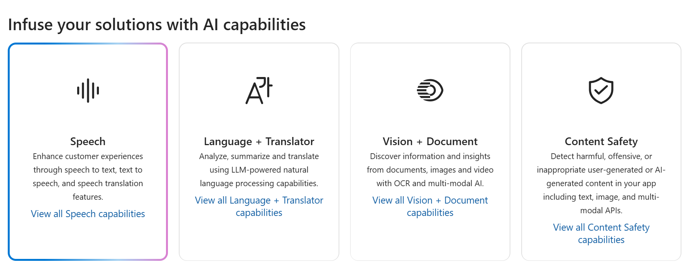

---
lab:
  title: 在 Azure AI Foundry 门户中探索语音
---

# 在 Azure AI Foundry 门户中探索语音

Azure AI 语音服务可将语音转换为文本，以及将文本转换为可听语音。**** 你可以使用 AI 语音创建一个应用程序，该应用程序可以转换会议笔记或基于采访录音生成文本。

在本练习中，你将使用 Azure AI Foundry 门户（Microsoft 创建智能应用程序的平台）中的 Azure AI 语音，以使用内置的试用体验转录音频。 

## 在 Azure AI Foundry 门户中创建项目

1. 在浏览器选项卡中，导航到 [Azure AI Foundry](https://ai.azure.com?azure-portal=true)。

1. 使用你的帐户登录。 

1. 在 Azure AI Foundry 门户主页上，选择“**创建项目**”。 在 Azure AI Foundry 中，项目是有助于组织工作的容器。  

    

1. 在“*创建项目*”窗格中，会看到生成的项目名称，可以按原样保留。 根据你过去是否创建了中心，你将看到要创建的*新* Azure 资源列表或现有中心的下拉列表。 如果看到现有中心的下拉列表，请选择“*新建中心*”，为中心创建唯一名称，然后选择“*下一步*”。  
 
    

> **重要说明**：需要在特定位置预配的 Azure AI 服务才能完成实验室的其余工作。

1. 在同一“*创建项目*”窗格中，选择“**自定义**”并选择以下“**位置**”之一：美国东部、法国中部、韩国中部、西欧或美国西部，以完成实验室的其余工作。 然后选择“**创建**”。 

1. 记下所创建的资源： 
- Azure AI 服务
- Azure AI 中心
- Azure AI 项目
- 存储帐户
- 密钥保管库
- 资源组  
 
1. 创建资源后，将转到项目的“*概述*”页。 在屏幕上的左侧菜单中，选择“**AI 服务**”。
 
      

1. 在“*AI 服务*”页上，选择“*语音*”磁贴以试用 Azure AI 语音功能。

    

## 在 Azure AI Foundry 的语音操场中探索语音转文本

让我们在 Azure AI Foundry 的语音操场中试用*实时语音转文本*。 

1. 在“*语音*”页上，向下滚动并选择“*试用语音功能*”下的“**实时语音转文本**”。 你将被带到“*语音操场*”。 

1. 选择 [https://aka.ms/mslearn-speech-files****](https://aka.ms/mslearn-speech-files) 以下载 speech.zip。**** 打开  文件夹。 

1. 在“*上传文件*”下，选择“**浏览文件**”并导航到保存相应文件的文件夹。 选择 WhatAICanDo.m4a，然后选择********“打开”。

    

1. 语音服务将实时听录和显示文本。 如果你的计算机上有音频，你可以在转换文本的同时听录音。

1. 查看输出，该输出应已成功识别音频并将其听录为文本。

在本练习中，你在 Azure AI Foundry 的语音操场中试用了 Azure AI 语音服务。 然后，使用实时语音转文本服务来听录录音内容。 你可以在播放音频文件时看到生成的听录文本。

## 清理

如果不打算做更多的练习，请删除任何不再需要的资源。 这可以避免产生任何不必要的成本。

1. 打开 [Azure 门户]( https://portal.azure.com)，然后选择包含你所创建的资源的资源组。
1. 选择该资源并选择“删除”，然后选择“是”以******** 进行确认。 这样便会删除该资源。

## 了解详细信息

本练习仅演示了语音服务的部分功能。 若要详细了解此服务的更多用途，请参阅[“语音”页](https://azure.microsoft.com/services/cognitive-services/speech-services)。
